# BirJob API - Job Data Monetization Platform

**Repository:** https://github.com/birjob/birjobAPI

## Table of Contents

1. [Platform Overview](#platform-overview)
2. [System Architecture](#system-architecture)
3. [Data Sources & Quality](#data-sources--quality)
4. [API Documentation](#api-documentation)
5. [Pricing & Monetization](#pricing--monetization)
6. [Technology Stack](#technology-stack)
7. [Database Design](#database-design)
8. [Development Roadmap](#development-roadmap)
9. [Business Model](#business-model)
10. [Security & Compliance](#security--compliance)
11. [Developer Experience](#developer-experience)
12. [Monitoring & Analytics](#monitoring--analytics)

## Platform Overview

BirJob API is a comprehensive job data monetization platform that aggregates employment opportunities from 50+ sources across Azerbaijan and neighboring regions. Built like RapidAPI, it provides developers and businesses with real-time access to structured job data through RESTful APIs, GraphQL endpoints, and webhook subscriptions.

### Key Value Propositions
- **Comprehensive Coverage**: 50+ job sources including major job boards, company websites, and government portals
- **Real-time Data**: Live job postings updated every 15 minutes
- **Structured Format**: Clean, normalized data with consistent schema
- **Developer-First**: RESTful APIs, GraphQL, SDKs, and comprehensive documentation
- **Scalable Pricing**: From free tier to enterprise solutions
- **Market Intelligence**: Analytics, trends, and insights

### Data Sources Overview

Our platform aggregates data from 50+ sources including:


## System Architecture

### High-Level Platform Architecture


### Data Flow Architecture

```mermaid
flowchart LR
    subgraph "Collection"
        SOURCE1["🌐 Job Board 1"]
        SOURCE2["🌐 Job Board 2"]
        SOURCE3["🌐 Job Board N"]
        SCRAPER["🕷️ Scraper Engine"]
    end
    
    subgraph "Processing"
        RAW_DATA[("📥 Raw Data<br/>Queue")]
        CLEANER["🧹 Data Cleaner"]
        NORMALIZER["⚖️ Normalizer"]
        ENRICHER["💎 Enricher"]
        DEDUPLICATOR["🔄 Deduplicator"]
    end
    
    subgraph "Storage"
        PRIMARY_DB[("🗄️ Primary DB<br/>PostgreSQL")]
        SEARCH_DB[("🔍 Search DB<br/>Elasticsearch")]
        CACHE_DB[("⚡ Cache<br/>Redis")]
        VECTOR_DB[("🧠 Vector DB<br/>Embeddings")]
    end
    
    subgraph "API Layer"
        API_GATEWAY["🚪 API Gateway"]
        REST["REST API"]
        GRAPHQL["GraphQL"]
        WEBHOOKS["Webhooks"]
    end
    
    subgraph "Clients"
        WEB_APP["🌐 Web Dashboard"]
        MOBILE_APP["📱 Mobile App"]
        THIRD_PARTY["🔗 Third Party APIs"]
        DEVELOPERS["👨‍💻 Developers"]
    end
    
    %% Data Collection Flow
    SOURCE1 --> SCRAPER
    SOURCE2 --> SCRAPER
    SOURCE3 --> SCRAPER
    SCRAPER --> RAW_DATA
    
    %% Processing Flow
    RAW_DATA --> CLEANER
    CLEANER --> NORMALIZER
    NORMALIZER --> ENRICHER
    ENRICHER --> DEDUPLICATOR
    
    %% Storage Flow
    DEDUPLICATOR --> PRIMARY_DB
    DEDUPLICATOR --> SEARCH_DB
    DEDUPLICATOR --> VECTOR_DB
    PRIMARY_DB --> CACHE_DB
    
    %% API Flow
    PRIMARY_DB --> API_GATEWAY
    SEARCH_DB --> API_GATEWAY
    CACHE_DB --> API_GATEWAY
    VECTOR_DB --> API_GATEWAY
    
    API_GATEWAY --> REST
    API_GATEWAY --> GRAPHQL
    API_GATEWAY --> WEBHOOKS
    
    %% Client Flow
    REST --> WEB_APP
    REST --> THIRD_PARTY
    GRAPHQL --> MOBILE_APP
    WEBHOOKS --> DEVELOPERS
    
    classDef sourceStyle fill:#e8f5e8,stroke:#2e7d32,stroke-width:2px
    classDef processStyle fill:#e3f2fd,stroke:#1565c0,stroke-width:2px
    classDef storageStyle fill:#fff8e1,stroke:#f57c00,stroke-width:2px
    classDef apiStyle fill:#fce4ec,stroke:#c2185b,stroke-width:2px
    classDef clientStyle fill:#f3e5f5,stroke:#7b1fa2,stroke-width:2px
    
    class SOURCE1,SOURCE2,SOURCE3,SCRAPER sourceStyle
    class RAW_DATA,CLEANER,NORMALIZER,ENRICHER,DEDUPLICATOR processStyle
    class PRIMARY_DB,SEARCH_DB,CACHE_DB,VECTOR_DB storageStyle
    class API_GATEWAY,REST,GRAPHQL,WEBHOOKS apiStyle
    class WEB_APP,MOBILE_APP,THIRD_PARTY,DEVELOPERS clientStyle
```



## Data Sources & Quality

### Current Data Sources (50+)

Based on the scraper analysis, our platform aggregates from these verified sources:

| Category | Sources | Count |
|----------|---------|-------|
| **Job Boards** | Smartjob, Glorri, HelloJob, Boss.az, eJob, Vakansiya.az, Ishelanlari, Is-elanlari, Banker.az, Offer.az, Isveren, Isqur, Jobbox, Vakansiya.biz, ProJobs, JobFinder, eKaryera, Staffy, Position.az, HRIN, 1is.az, DEJobs, JobSearch | 23 |
| **Corporate** | Azercell, Azerconnect, ABB Bank, Kapital Bank, Bank of Baku, Baku Electronics, ASCO, CBAR, ADA University, Bravo, MDM, ARTI, HCB, BFB, Ziraat, Guavapay, Revolut, Andersen | 18 |
| **Government** | ITS Gov, TABIB, Oil Fund, Azercosmos, UN Jobs, Regulator | 6 |
| **Specialized** | Airswift, Orion, HRC Baku, CanScreen, Fintech Farm, The Muse | 6 |

### Data Quality Metrics


### Data Schema

Our standardized job posting schema includes:

```typescript
interface JobPosting {
  // Core Fields
  id: string;
  title: string;
  company: string;
  description?: string;
  location?: string;
  
  // Employment Details
  employmentType?: 'full-time' | 'part-time' | 'contract' | 'temporary' | 'internship';
  remoteType?: 'remote' | 'hybrid' | 'on-site';
  experienceLevel?: 'entry' | 'mid' | 'senior' | 'executive';
  
  // Compensation
  salaryMin?: number;
  salaryMax?: number;
  currency?: string;
  salaryPeriod?: 'hourly' | 'daily' | 'monthly' | 'yearly';
  
  // Requirements & Benefits
  requirements?: string[];
  skills?: string[];
  benefits?: string[];
  qualifications?: string[];
  
  // Application Details
  applyLink: string;
  applicationDeadline?: Date;
  contactEmail?: string;
  
  // Metadata
  source: string;
  sourceCategory: 'job-board' | 'corporate' | 'government' | 'specialized';
  scrapedAt: Date;
  postedAt?: Date;
  updatedAt?: Date;
  isActive: boolean;
  
  // AI-Enhanced Fields
  skillsExtracted?: string[];
  categoryPredicted?: string;
  industryClassified?: string;
  salaryPredicted?: number;
  matchScore?: number;
  
  // Geo Data
  coordinates?: {
    latitude: number;
    longitude: number;
  };
  region?: string;
  country?: string;
}
```

## API Documentation

### Authentication

All API requests require authentication via API keys:

```bash
curl -H "Authorization: Bearer YOUR_API_KEY" \
     -H "Content-Type: application/json" \
     https://api.birjob.com/v1/jobs
```

### Core Endpoints

#### 1. Job Search API

```http
GET /v1/jobs
```

**Parameters:**
- `q` (string): Search query
- `location` (string): Job location filter
- `company` (string): Company name filter
- `source` (string): Data source filter
- `employment_type` (string): Employment type filter
- `remote_type` (string): Remote work filter
- `salary_min` (number): Minimum salary
- `salary_max` (number): Maximum salary
- `posted_since` (string): Date filter (ISO 8601)
- `limit` (number): Results per page (max 100)
- `offset` (number): Pagination offset
- `sort` (string): Sort order (relevance, date, salary)

**Example Request:**
```bash
curl "https://api.birjob.com/v1/jobs?q=software+engineer&location=Baku&limit=20&sort=date" \
  -H "Authorization: Bearer YOUR_API_KEY"
```

**Response:**
```json
{
  "data": [
    {
      "id": "job_12345",
      "title": "Senior Software Engineer",
      "company": "Tech Company",
      "location": "Baku, Azerbaijan",
      "employmentType": "full-time",
      "remoteType": "hybrid",
      "salaryMin": 2000,
      "salaryMax": 3500,
      "currency": "AZN",
      "skills": ["JavaScript", "React", "Node.js"],
      "applyLink": "https://company.com/apply/12345",
      "source": "Smartjob",
      "sourceCategory": "job-board",
      "postedAt": "2024-01-15T09:00:00Z",
      "scrapedAt": "2024-01-15T09:15:00Z",
      "isActive": true
    }
  ],
  "pagination": {
    "total": 1250,
    "limit": 20,
    "offset": 0,
    "hasNext": true,
    "hasPrev": false
  },
  "meta": {
    "took": 45,
    "sources": ["Smartjob", "Glorri", "HelloJob"],
    "searchId": "search_98765"
  }
}
```

#### 2. Job Details API

```http
GET /v1/jobs/{job_id}
```

**Example:**
```bash
curl "https://api.birjob.com/v1/jobs/job_12345" \
  -H "Authorization: Bearer YOUR_API_KEY"
```

#### 3. Company Jobs API

```http
GET /v1/companies/{company_name}/jobs
```

#### 4. Job Categories API

```http
GET /v1/categories
```

#### 5. Sources API

```http
GET /v1/sources
```

### GraphQL API

```graphql
query SearchJobs($query: String!, $filters: JobFilters, $pagination: PaginationInput) {
  jobs(query: $query, filters: $filters, pagination: $pagination) {
    data {
      id
      title
      company
      location
      employmentType
      remoteType
      salary {
        min
        max
        currency
      }
      skills
      applyLink
      source
      postedAt
    }
    pagination {
      total
      hasNext
      hasPrev
    }
  }
}
```

### Webhooks

Subscribe to real-time job updates:

```json
{
  "url": "https://your-app.com/webhooks/jobs",
  "events": ["job.created", "job.updated", "job.deleted"],
  "filters": {
    "location": "Baku",
    "skills": ["JavaScript", "Python"],
    "salaryMin": 1500
  },
  "secret": "webhook_secret_key"
}
```

### Rate Limits

| Tier | Requests/minute | Requests/day | Concurrent |
|------|----------------|--------------|------------|
| Free | 60 | 1,000 | 2 |
| Basic | 300 | 10,000 | 5 |
| Pro | 1,200 | 50,000 | 10 |
| Enterprise | Custom | Custom | Custom |

## Pricing & Monetization

### Pricing Tiers

```mermaid
graph TB
    subgraph "Free Tier - $0/month"
        FREE_FEATURES["✅ 1,000 API calls/day<br/>✅ Basic job search<br/>✅ 7-day data history<br/>❌ No webhooks<br/>❌ No analytics<br/>❌ Community support"]
    end
    
    subgraph "Basic Tier - $49/month"
        BASIC_FEATURES["✅ 10,000 API calls/day<br/>✅ Full job search<br/>✅ 30-day data history<br/>✅ Basic webhooks<br/>✅ Usage analytics<br/>✅ Email support"]
    end
    
    subgraph "Pro Tier - $199/month"
        PRO_FEATURES["✅ 50,000 API calls/day<br/>✅ Advanced search & filters<br/>✅ 90-day data history<br/>✅ Real-time webhooks<br/>✅ Advanced analytics<br/>✅ GraphQL access<br/>✅ Priority support"]
    end
    
    subgraph "Enterprise Tier - Custom"
        ENTERPRISE_FEATURES["✅ Unlimited API calls<br/>✅ Custom integrations<br/>✅ Full data history<br/>✅ Custom webhooks<br/>✅ White-label options<br/>✅ SLA guarantees<br/>✅ Dedicated support<br/>✅ On-premise deployment"]
    end
    
    FREE_FEATURES --> BASIC_FEATURES
    BASIC_FEATURES --> PRO_FEATURES
    PRO_FEATURES --> ENTERPRISE_FEATURES
    
    classDef freeStyle fill:#e8f5e8,stroke:#2e7d32,stroke-width:2px
    classDef basicStyle fill:#e3f2fd,stroke:#1565c0,stroke-width:2px
    classDef proStyle fill:#fff8e1,stroke:#f57c00,stroke-width:2px
    classDef enterpriseStyle fill:#fce4ec,stroke:#c2185b,stroke-width:2px
    
    class FREE_FEATURES freeStyle
    class BASIC_FEATURES basicStyle
    class PRO_FEATURES proStyle
    class ENTERPRISE_FEATURES enterpriseStyle
```



### Additional Revenue Streams

| Service | Price | Description |
|---------|-------|-------------|
| **Custom Data Extraction** | $0.10/job | Extract jobs from custom sources |
| **Historical Data Access** | $299/month | Access to 2+ years of historical data |
| **AI Job Matching** | $0.05/match | ML-powered job relevance scoring |
| **White-label Solution** | $2,999/month | Branded API platform |
| **Consulting Services** | $200/hour | Custom integration & development |
| **Data Exports** | $99/export | Bulk data downloads (CSV, JSON) |

### Usage-Based Pricing


## Technology Stack

### Backend Services
- **Runtime**: Node.js 20+ with TypeScript
- **Framework**: Fastify for high-performance APIs
- **API Standards**: REST + GraphQL with Apollo Server
- **Authentication**: JWT with API key management
- **Validation**: Zod for request/response validation
- **Rate Limiting**: Custom middleware with Redis

### Data Processing
- **Scraping**: Puppeteer + Playwright for dynamic content
- **Queue System**: Bull/BullMQ with Redis
- **ETL Pipeline**: Apache Airflow for orchestration
- **ML/AI**: Python services with scikit-learn, spaCy
- **Search Engine**: Elasticsearch 8+ for full-text search

### Database Layer
- **Primary**: PostgreSQL 15+ with Prisma ORM
- **Cache**: Redis 7+ cluster for high availability
- **Vector Store**: Pinecone for semantic job matching
- **Time Series**: InfluxDB for metrics and analytics
- **Document Store**: MongoDB for unstructured data

### Infrastructure
- **Containerization**: Docker + Kubernetes
- **Cloud Platform**: AWS with multi-region deployment
- **API Gateway**: Kong or AWS API Gateway
- **CDN**: CloudFlare for global distribution
- **Monitoring**: DataDog + ELK Stack
- **CI/CD**: GitHub Actions with automated testing

### Developer Tools
- **Documentation**: OpenAPI 3.0 + Redoc
- **SDKs**: Auto-generated for JavaScript, Python, PHP, Go
- **Testing**: Postman collections + automated tests
- **Sandbox**: Interactive API explorer

## Database Design

### Core Tables Schema


### Indexing Strategy

```sql
-- Performance indexes for job search
CREATE INDEX idx_jobs_title_search ON job_postings USING GIN(to_tsvector('english', title));
CREATE INDEX idx_jobs_company ON job_postings(company);
CREATE INDEX idx_jobs_location ON job_postings(location);
CREATE INDEX idx_jobs_posted_date ON job_postings(posted_at DESC);
CREATE INDEX idx_jobs_salary_range ON job_postings(salary_min, salary_max);
CREATE INDEX idx_jobs_skills ON job_postings USING GIN(skills);
CREATE INDEX idx_jobs_source ON job_postings(source);
CREATE INDEX idx_jobs_active ON job_postings(is_active) WHERE is_active = true;

-- API usage analytics
CREATE INDEX idx_usage_api_key_date ON api_usage(api_key_id, usage_date);
CREATE INDEX idx_usage_endpoint ON api_usage(endpoint, timestamp);
CREATE INDEX idx_usage_date_range ON api_usage(timestamp) WHERE timestamp >= NOW() - INTERVAL '30 days';

-- Performance monitoring
CREATE INDEX idx_logs_source_date ON scraper_logs(source_id, started_at DESC);
CREATE INDEX idx_webhooks_user_active ON webhooks(user_id) WHERE is_active = true;
```

## Development Roadmap

### Development Timeline


### Feature Priorities

| Priority | Feature | Timeline | Effort |
|----------|---------|----------|---------|
| **Critical** | REST API Core | Q1 2024 | 3 months |
| **Critical** | Authentication & Billing | Q1 2024 | 2 months |
| **High** | GraphQL API | Q2 2024 | 1.5 months |
| **High** | Webhooks | Q2 2024 | 1.5 months |
| **High** | Advanced Search | Q2 2024 | 1 month |
| **Medium** | AI Classification | Q3 2024 | 2 months |
| **Medium** | Semantic Search | Q3 2024 | 1.5 months |
| **Low** | White-label | Q4 2024 | 2 months |
| **Low** | Mobile SDKs | Q2 2025 | 1.5 months |

## Business Model

### Revenue Model Overview


### Customer Segments

```mermaid
graph TB
    subgraph "Developers & Startups"
        DEV_FEATURES["🧑‍💻 Individual Developers<br/>• Job aggregator apps<br/>• Portfolio projects<br/>• Learning & experiments<br/>💰 Free → $49/month"]
    end
    
    subgraph "SMB & Scale-ups"
        SMB_FEATURES["🏢 Small-Medium Businesses<br/>• HR tech companies<br/>• Recruitment agencies<br/>• Job board platforms<br/>💰 $49 → $199/month"]
    end
    
    subgraph "Enterprise"
        ENT_FEATURES["🏭 Large Enterprises<br/>• Multinational corporations<br/>• Government agencies<br/>• Major job platforms<br/>💰 $2,000+/month"]
    end
    
    subgraph "Partners"
        PARTNER_FEATURES["🤝 Integration Partners<br/>• ATS providers<br/>• CRM systems<br/>• Analytics platforms<br/>💰 Revenue sharing"]
    end
    
    classDef devStyle fill:#e8f5e8,stroke:#2e7d32,stroke-width:2px
    classDef smbStyle fill:#e3f2fd,stroke:#1565c0,stroke-width:2px
    classDef entStyle fill:#fff8e1,stroke:#f57c00,stroke-width:2px
    classDef partnerStyle fill:#fce4ec,stroke:#c2185b,stroke-width:2px
    
    class DEV_FEATURES devStyle
    class SMB_FEATURES smbStyle
    class ENT_FEATURES entStyle
    class PARTNER_FEATURES partnerStyle
```



### Revenue Projections


**Year 1 Targets:**
- **Month 6**: $23,400 MRR (150 customers: 100 Basic, 40 Pro, 10 Enterprise)
- **Month 12**: $95,400 MRR (500 customers: 300 Basic, 150 Pro, 50 Enterprise)

### Key Metrics & KPIs

| Metric | Target (Month 12) | Current |
|--------|------------------|---------|
| **Monthly Recurring Revenue** | $95,400 | $0 |
| **Active API Keys** | 2,000+ | 0 |
| **Daily API Calls** | 5M+ | 0 |
| **Customer Churn Rate** | <5% | N/A |
| **Customer Acquisition Cost** | <$150 | N/A |
| **Average Revenue Per User** | $191/month | N/A |
| **API Uptime** | 99.9% | N/A |
| **Response Time** | <200ms | N/A |

## Security & Compliance

### Security Architecture

```mermaid
graph TB
    subgraph "Perimeter Security"
        WAF["🛡️ Web Application Firewall<br/>• DDoS Protection<br/>• Bot Detection<br/>• IP Filtering"]
        CDN["🌐 CDN Security<br/>• Edge Protection<br/>• SSL/TLS Termination<br/>• Geographic Filtering"]
    end
    
    subgraph "API Security"
        API_AUTH["🔐 API Authentication<br/>• API Key Management<br/>• JWT Tokens<br/>• OAuth 2.0"]
        RATE_LIMIT["⏱️ Rate Limiting<br/>• Per-key Limits<br/>• Burst Protection<br/>• Fair Usage"]
        INPUT_VAL["✅ Input Validation<br/>• Schema Validation<br/>• SQL Injection Prevention<br/>• XSS Protection"]
    end
    
    subgraph "Data Security"
        ENCRYPTION["🔒 Encryption<br/>• AES-256 at Rest<br/>• TLS 1.3 in Transit<br/>• Key Rotation"]
        ACCESS_CTRL["👥 Access Control<br/>• RBAC<br/>• Principle of Least Privilege<br/>• Multi-factor Auth"]
        AUDIT["📋 Audit Logging<br/>• Access Logs<br/>• Change Tracking<br/>• Compliance Reports"]
    end
    
    subgraph "Infrastructure Security"
        VPC["🏗️ Network Isolation<br/>• Private VPC<br/>• Subnet Segmentation<br/>• Security Groups"]
        MONITORING["👁️ Security Monitoring<br/>• SIEM Integration<br/>• Anomaly Detection<br/>• Incident Response"]
        BACKUP["💾 Secure Backups<br/>• Encrypted Backups<br/>• Point-in-time Recovery<br/>• Disaster Recovery"]
    end
    
    classDef securityStyle fill:#ffebee,stroke:#c62828,stroke-width:2px
    
    class WAF,CDN,API_AUTH,RATE_LIMIT,INPUT_VAL,ENCRYPTION,ACCESS_CTRL,AUDIT,VPC,MONITORING,BACKUP securityStyle
```



### Compliance Framework

| Standard | Status | Description |
|----------|--------|-------------|
| **GDPR** | ✅ Planned | EU data protection compliance |
| **SOC 2 Type II** | 📋 Planned | Security and availability controls |
| **ISO 27001** | 🎯 Future | Information security management |
| **PCI DSS** | ✅ Required | Payment processing security |

### Data Privacy

- **Data Minimization**: Collect only necessary job posting data
- **Anonymization**: Remove PII from analytics and logs
- **Right to Erasure**: API for data deletion requests
- **Data Portability**: Export functionality for user data
- **Consent Management**: Clear opt-in/opt-out mechanisms

## Developer Experience

### Documentation Strategy

```mermaid
graph TB
    subgraph "Getting Started"
        QUICKSTART["⚡ Quick Start<br/>• 5-minute setup<br/>• Sample requests<br/>• Authentication guide"]
        TUTORIALS["📚 Tutorials<br/>• Use case examples<br/>• Step-by-step guides<br/>• Video walkthroughs"]
    end
    
    subgraph "API Reference"
        OPENAPI["📖 OpenAPI Spec<br/>• Interactive docs<br/>• Request/response examples<br/>• Error codes"]
        GRAPHQL_DOCS["🔗 GraphQL Schema<br/>• Type definitions<br/>• Query examples<br/>• Subscription guides"]
    end
    
    subgraph "SDKs & Tools"
        SDKS["🛠️ Official SDKs<br/>• JavaScript/TypeScript<br/>• Python<br/>• PHP, Go, Ruby"]
        POSTMAN["📮 Postman Collection<br/>• Pre-configured requests<br/>• Environment variables<br/>• Test scripts"]
    end
    
    subgraph "Support & Community"
        SUPPORT["🎧 Developer Support<br/>• Discord community<br/>• Email support<br/>• GitHub issues"]
        BLOG["📝 Developer Blog<br/>• Technical articles<br/>• Use case studies<br/>• API updates"]
    end
    
    classDef docsStyle fill:#e8f5e8,stroke:#2e7d32,stroke-width:2px
    
    class QUICKSTART,TUTORIALS,OPENAPI,GRAPHQL_DOCS,SDKS,POSTMAN,SUPPORT,BLOG docsStyle
```



### SDK Examples

#### JavaScript/TypeScript SDK

```typescript
import { BirJobAPI } from '@birjob/api-client';

const client = new BirJobAPI({
  apiKey: 'your-api-key',
  environment: 'production' // or 'sandbox'
});

// Search jobs
const jobs = await client.jobs.search({
  query: 'software engineer',
  location: 'Baku',
  limit: 20,
  filters: {
    employmentType: 'full-time',
    remoteType: 'hybrid',
    salaryMin: 1500
  }
});

// Get job details
const job = await client.jobs.get('job_12345');

// Subscribe to webhook
await client.webhooks.create({
  url: 'https://your-app.com/webhook',
  events: ['job.created', 'job.updated'],
  filters: {
    location: 'Baku',
    skills: ['JavaScript', 'React']
  }
});
```

#### Python SDK

```python
from birjob_api import BirJobClient

client = BirJobClient(api_key='your-api-key')

# Search jobs
jobs = client.jobs.search(
    query='software engineer',
    location='Baku',
    limit=20,
    filters={
        'employment_type': 'full-time',
        'remote_type': 'hybrid',
        'salary_min': 1500
    }
)

# Async support
import asyncio
from birjob_api import AsyncBirJobClient

async def main():
    async_client = AsyncBirJobClient(api_key='your-api-key')
    jobs = await async_client.jobs.search(query='developer')
    
asyncio.run(main())
```

### Interactive API Explorer

Provide a built-in API explorer similar to Swagger UI but enhanced with:
- **Live data**: Real job postings in examples
- **Code generation**: Auto-generate code in multiple languages
- **Rate limit visualization**: Show remaining quota
- **Response schemas**: Interactive schema explorer

## Monitoring & Analytics

### System Monitoring

```mermaid
graph TB
    subgraph "Infrastructure Metrics"
        CPU["💻 CPU Usage<br/>• Average load<br/>• Peak utilization<br/>• Scaling triggers"]
        MEMORY["🧠 Memory Usage<br/>• RAM consumption<br/>• Memory leaks<br/>• GC performance"]
        DISK["💽 Disk I/O<br/>• Read/write ops<br/>• Storage usage<br/>• IOPS monitoring"]
        NETWORK["🌐 Network<br/>• Bandwidth usage<br/>• Latency metrics<br/>• Packet loss"]
    end
    
    subgraph "Application Metrics"
        API_PERF["📊 API Performance<br/>• Response times<br/>• Throughput (RPS)<br/>• Error rates"]
        DB_PERF["🗄️ Database Performance<br/>• Query execution times<br/>• Connection pools<br/>• Slow query logs"]
        QUEUE_PERF["⚡ Queue Performance<br/>• Job processing times<br/>• Queue depths<br/>• Failed jobs"]
    end
    
    subgraph "Business Metrics"
        API_USAGE["📈 API Usage<br/>• Calls per endpoint<br/>• User activity<br/>• Feature adoption"]
        REVENUE["💰 Revenue Tracking<br/>• MRR growth<br/>• Customer churn<br/>• Usage billing"]
        DATA_QUALITY["✅ Data Quality<br/>• Scraping success rates<br/>• Data freshness<br/>• Error rates"]
    end
    
    subgraph "Alerts & Notifications"
        CRITICAL["🚨 Critical Alerts<br/>• System downtime<br/>• Data pipeline failures<br/>• Security incidents"]
        WARNING["⚠️ Warning Alerts<br/>• High error rates<br/>• Performance degradation<br/>• Quota approaching"]
        INFO["ℹ️ Info Notifications<br/>• Deployment status<br/>• Maintenance windows<br/>• Feature releases"]
    end
    
    classDef infraStyle fill:#e3f2fd,stroke:#1565c0,stroke-width:2px
    classDef appStyle fill:#e8f5e8,stroke:#2e7d32,stroke-width:2px
    classDef businessStyle fill:#fff8e1,stroke:#f57c00,stroke-width:2px
    classDef alertStyle fill:#ffebee,stroke:#c62828,stroke-width:2px
    
    class CPU,MEMORY,DISK,NETWORK infraStyle
    class API_PERF,DB_PERF,QUEUE_PERF appStyle
    class API_USAGE,REVENUE,DATA_QUALITY businessStyle
    class CRITICAL,WARNING,INFO alertStyle
```



### Analytics Dashboard

Key metrics tracked:

| Category | Metrics | Frequency |
|----------|---------|-----------|
| **API Performance** | Response time, Error rate, Throughput | Real-time |
| **Usage Analytics** | API calls, Unique users, Popular endpoints | Daily |
| **Business KPIs** | Revenue, Churn, Customer growth | Weekly |
| **Data Quality** | Source uptime, Data freshness, Coverage | Hourly |
| **Infrastructure** | CPU, Memory, Disk, Network | Real-time |

### Customer Analytics

Provide customers with usage dashboards showing:
- **API Usage**: Calls over time, popular endpoints
- **Quota Status**: Remaining calls, overage alerts
- **Response Times**: Performance metrics for their requests
- **Error Analysis**: Failed requests with debugging info
- **Cost Tracking**: Current month charges and projections

This comprehensive documentation provides a complete foundation for building and launching the BirJob API monetization platform, positioning it as a competitive alternative to RapidAPI with specialized focus on job market data.
